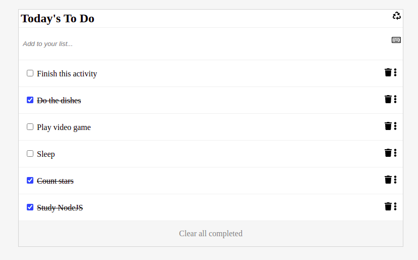

# # to-do-list

> To do list as part of Microverse JavaScript curriculum exercise

The objective of this exercise so far is to display a list of things to do on the webpage using Webpack and JS and style it using CSS.

New features: Now it is possible to drag and drop items and to mark items as completed or not.

Another new features: You can remove elements, add more elements, and remove all completed!

## Built With

- HTML
- CSS
- JavaScript
- VSCode
- Webpack
- Ubuntu 20.04
- Fontawesome
- Drag and Drop API
- LocalStorage API
- Linters

## Setup

- Get the link of the repository 
- Clone it as `git clone git@github.com:arthurborgesdev/to-do-list.git`

## Usage

- Run `npm install` on a Terminal to install the modules
- Run `npm run build` on a Terminal to build the assets using webpack
- Run `npm run start` on a Terminal to start the server and look at the result in `localhost:8080`

## Authors

👤 **Arthur Borges**

- GitHub: [@arthuborgesdev](https://github.com/arthurborgesdev)
- Twitter: [@arthurmoises](https://twitter.com/arthurmoises)
- LinkedIn: [Arthur Borges](https://linkedin.com/in/arthurmoises)

## 🤝 Contributing

Contributions, issues, and feature requests are welcome!

## Show your support

Give a ⭐️ if you like this project!

## Acknowledgments

- Microverse
- Webpack documentation
- Web documentation (W3Schools, MDN, Stack Overflow)
- Friends, lots of great and awesome friends!
